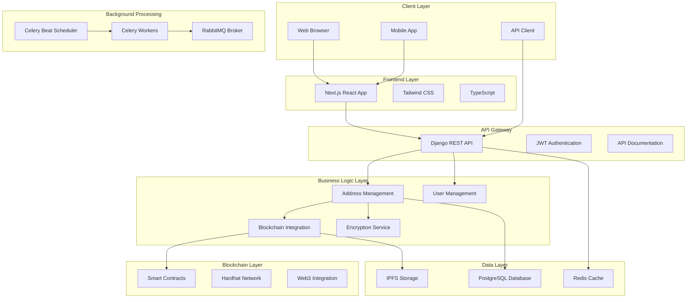
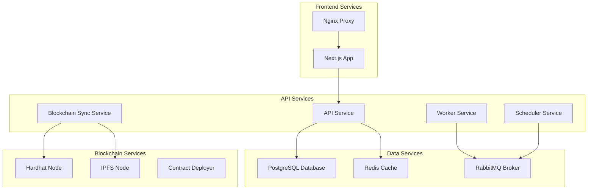
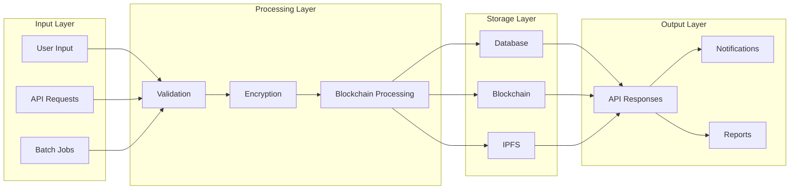
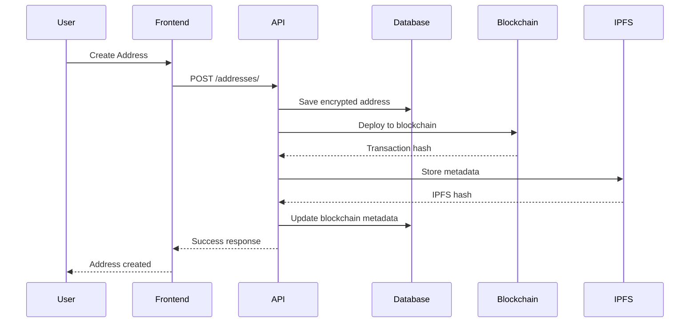
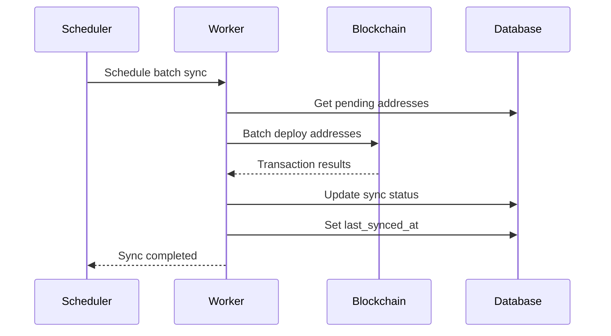
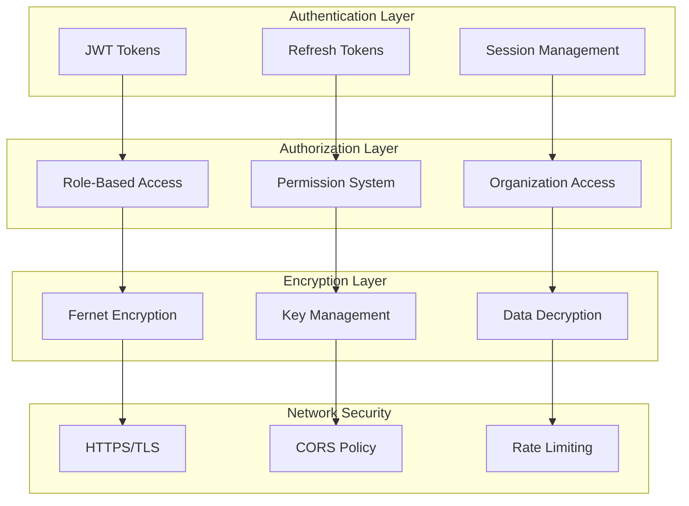
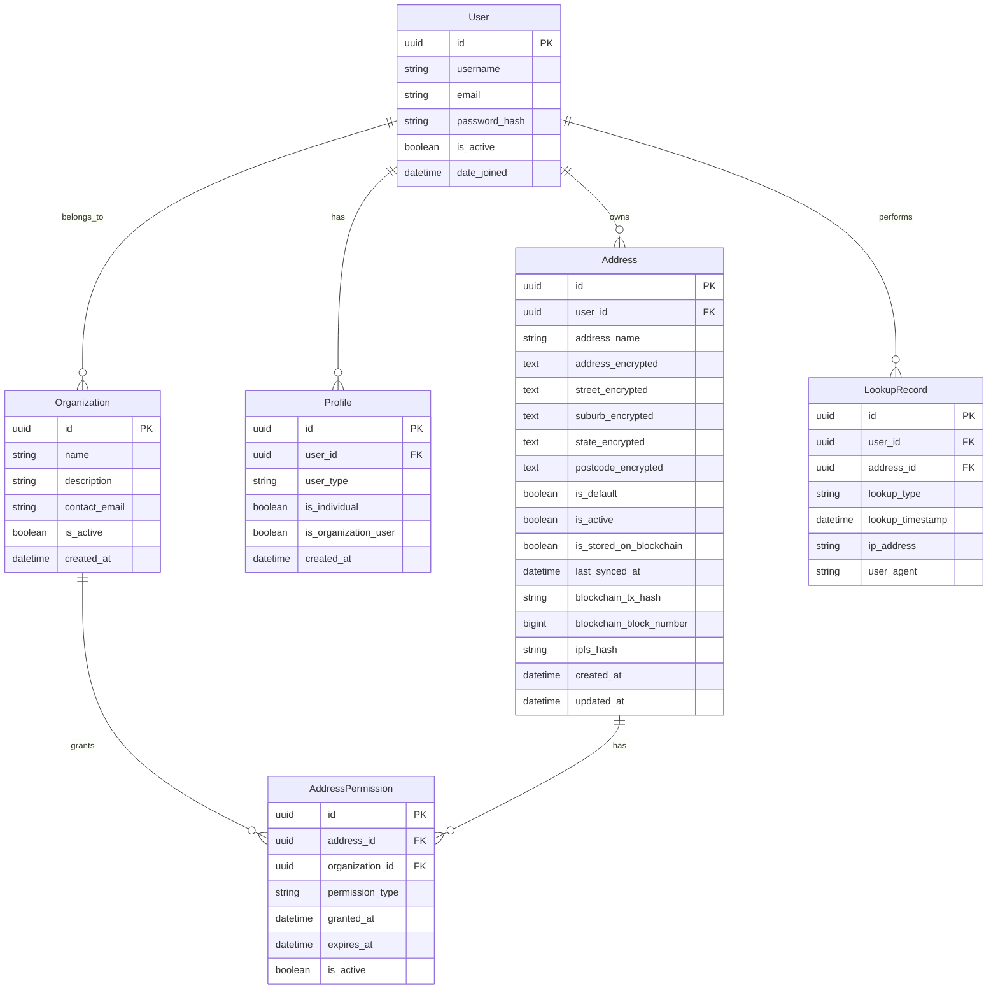
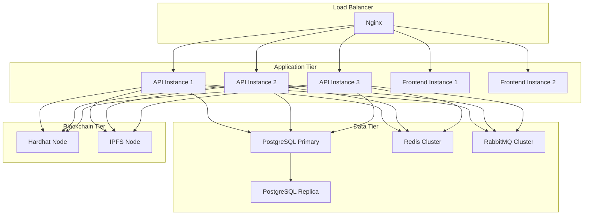
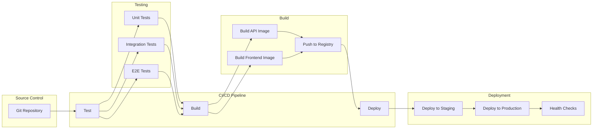

# System Architecture Diagrams

## High-Level System Architecture

## Microservices Architecture

## Data Flow Architecture

## Blockchain Integration Flow

## Batch Synchronization Flow

## Security Architecture

## Database Schema

## Deployment Architecture

## CI/CD Pipeline

