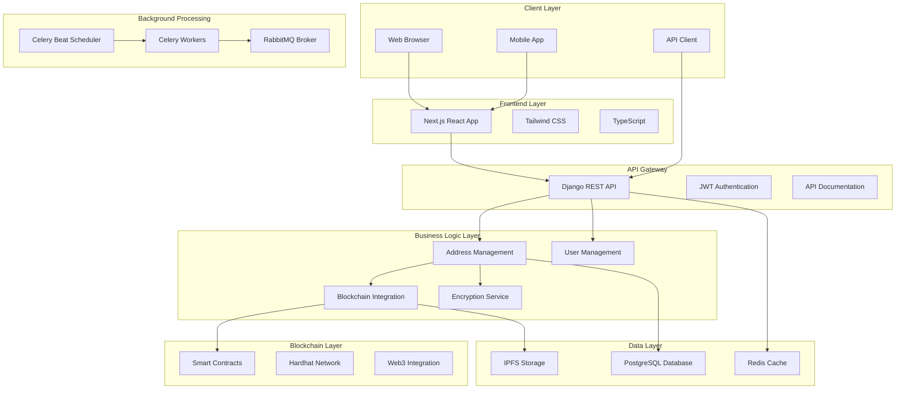
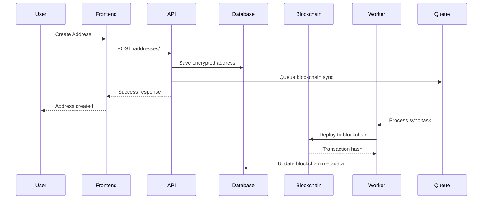
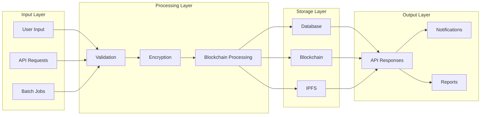

# MyAddressHub - Complete Technical Specification

**Project**: MyAddressHub - Blockchain-Integrated Address Management System  
**Version**: 1.0.0  
**Date**: September 13, 2025  
**Author**: Technical Documentation Team  
**Course**: Advanced Web Development & Blockchain Integration  

---

## Table of Contents

1. [Executive Summary](#1-executive-summary)
2. [System Architecture](#2-system-architecture)
3. [Technology Stack](#3-technology-stack)
4. [Database Design](#4-database-design)
5. [API Architecture](#5-api-architecture)
6. [Blockchain Integration](#6-blockchain-integration)
7. [Security Implementation](#7-security-implementation)
8. [Frontend Architecture](#8-frontend-architecture)
9. [DevOps & Deployment](#9-devops--deployment)
10. [Performance & Scalability](#10-performance--scalability)
11. [Testing Strategy](#11-testing-strategy)
12. [Monitoring & Logging](#12-monitoring--logging)
13. [Implementation Timeline](#13-implementation-timeline)
14. [Risk Assessment](#14-risk-assessment)
15. [Future Enhancements](#15-future-enhancements)
16. [Conclusion](#16-conclusion)

---

## 1. Executive Summary

### 1.1 Project Overview

**MyAddressHub** is a cutting-edge, full-stack web application that revolutionizes address management through the integration of traditional web technologies with blockchain infrastructure. The system provides a secure, scalable, and decentralized solution for storing and managing address information across multiple users and organizations.

### 1.2 Key Innovation

The primary innovation of MyAddressHub lies in its **hybrid storage architecture**, which combines:
- **Encrypted database storage** for fast retrieval and querying
- **Blockchain persistence** for immutable, decentralized storage
- **IPFS integration** for metadata and file storage
- **Real-time synchronization** between all storage layers

### 1.3 Technical Achievements

- **Blockchain Integration**: Smart contract-based address storage on Ethereum/Polygon networks
- **Advanced Security**: End-to-end encryption using Fernet cryptography
- **Microservices Architecture**: Scalable containerized services
- **Real-time Processing**: Automated batch synchronization with Celery workers
- **Modern UI/UX**: Responsive design with dark/light theme support
- **Comprehensive Testing**: Unit, integration, and end-to-end testing strategies

### 1.4 Business Value

- **Data Integrity**: Immutable blockchain storage ensures address data cannot be tampered with
- **Privacy Protection**: Advanced encryption protects sensitive address information
- **Scalability**: Microservices architecture supports horizontal scaling
- **Compliance**: Audit trails and permission systems meet regulatory requirements
- **User Experience**: Modern, intuitive interface for both individual and organizational users

---

## 2. System Architecture

### 2.1 High-Level Architecture

### 2.2 Microservices Architecture

The system follows a microservices pattern with the following services:

#### 2.2.1 Core Services

| Service | Purpose | Technology | Port |
|---------|---------|------------|------|
| **API Service** | Django REST API server | Python/Django | 8000 |
| **Frontend Service** | Next.js React application | Node.js/React | 3000 |
| **Database Service** | PostgreSQL database | PostgreSQL 15 | 5432 |
| **Cache Service** | Redis caching and sessions | Redis 7 | 6379 |

#### 2.2.2 Background Processing Services

| Service | Purpose | Technology | Port |
|---------|---------|------------|------|
| **Worker Service** | Celery background task processor | Python/Celery | - |
| **Scheduler Service** | Celery Beat periodic task scheduler | Python/Celery Beat | - |
| **Blockchain Sync Service** | Dedicated blockchain synchronization | Python/Celery | - |
| **Message Broker** | RabbitMQ for task queue management | RabbitMQ 3 | 5672, 15672 |

#### 2.2.3 Blockchain Services

| Service | Purpose | Technology | Port |
|---------|---------|------------|------|
| **Hardhat Node** | Local Ethereum development node | Node.js/Hardhat | 8546 |
| **IPFS Node** | Decentralized file storage | IPFS Kubo | 4001, 5001, 8080 |
| **Contract Deployer** | Smart contract deployment | Node.js/Hardhat | - |

### 2.3 Service Communication

### 2.4 Data Flow Architecture

---

## 3. Technology Stack

### 3.1 Backend Technologies

#### 3.1.1 Core Framework

| Component | Technology | Version | Purpose |
|-----------|------------|---------|---------|
| **Framework** | Django | 4.2.10 | Web framework and ORM |
| **API Framework** | Django REST Framework | 3.14.0 | RESTful API development |
| **Language** | Python | 3.11 | Primary programming language |
| **WSGI Server** | Gunicorn | 21.2.0 | Production WSGI server |

#### 3.1.2 Database & Storage

| Component | Technology | Version | Purpose |
|-----------|------------|---------|---------|
| **Primary Database** | PostgreSQL | 15 | Relational data storage |
| **Cache** | Redis | 7 | Caching and session storage |
| **File Storage** | IPFS | Latest | Decentralized file storage |
| **Database Adapter** | psycopg2-binary | 2.9.9 | PostgreSQL Python adapter |

#### 3.1.3 Authentication & Security

| Component | Technology | Version | Purpose |
|-----------|------------|---------|---------|
| **Authentication** | JWT (SimpleJWT) | 5.3.0 | Token-based authentication |
| **Password Hashing** | Argon2 | 23.1.0 | Secure password hashing |
| **Encryption** | Cryptography | 41.0.7 | Data encryption/decryption |
| **Security** | django-axes | 7.1.0 | Brute force protection |

#### 3.1.4 Background Processing

| Component | Technology | Version | Purpose |
|-----------|------------|---------|---------|
| **Task Queue** | Celery | 5.3.4 | Asynchronous task processing |
| **Message Broker** | RabbitMQ | 3 | Task queue broker |
| **Task Scheduler** | Celery Beat | 2.5.0 | Periodic task scheduling |
| **Result Backend** | Redis | 5.0.1 | Task result storage |

#### 3.1.5 Blockchain Integration

| Component | Technology | Version | Purpose |
|-----------|------------|---------|---------|
| **Web3 Library** | Web3.py | 6.11.3 | Ethereum blockchain interaction |
| **IPFS Client** | ipfshttpclient | 0.7.0 | IPFS integration |
| **Ethereum Account** | eth-account | 0.9.0 | Ethereum account management |
| **Ethereum Utils** | eth-utils | 2.2.0 | Ethereum utility functions |

### 3.2 Frontend Technologies

#### 3.2.1 Core Framework

| Component | Technology | Version | Purpose |
|-----------|------------|---------|---------|
| **Framework** | Next.js | 14.1.0 | React framework with SSR |
| **Language** | TypeScript | 5.3.3 | Type-safe JavaScript |
| **Runtime** | Node.js | 18+ | JavaScript runtime |
| **Package Manager** | npm/yarn | Latest | Dependency management |

#### 3.2.2 UI & Styling

| Component | Technology | Version | Purpose |
|-----------|------------|---------|---------|
| **CSS Framework** | Tailwind CSS | 3.4.1 | Utility-first CSS framework |
| **UI Components** | Radix UI | Latest | Accessible component library |
| **Icons** | Lucide React | 0.330.0 | Icon library |
| **Animations** | tailwindcss-animate | 1.0.7 | CSS animations |

#### 3.2.3 State Management & Data

| Component | Technology | Version | Purpose |
|-----------|------------|---------|---------|
| **State Management** | React Context | Built-in | Global state management |
| **HTTP Client** | Axios | 1.6.7 | API communication |
| **Data Fetching** | SWR | 2.2.4 | Data fetching and caching |
| **Form Handling** | React Hook Form | 7.50.1 | Form validation and management |

#### 3.2.4 Development Tools

| Component | Technology | Version | Purpose |
|-----------|------------|---------|---------|
| **Linting** | ESLint | 8.56.0 | Code linting |
| **Formatting** | Prettier | 3.2.5 | Code formatting |
| **Type Checking** | TypeScript | 5.3.3 | Static type checking |
| **Testing** | Jest/Playwright | Latest | Unit and E2E testing |

### 3.3 Blockchain Technologies

#### 3.3.1 Smart Contract Development

| Component | Technology | Version | Purpose |
|-----------|------------|---------|---------|
| **Language** | Solidity | ^0.8.0 | Smart contract programming |
| **Framework** | Hardhat | Latest | Ethereum development environment |
| **Testing** | Chai/Mocha | Latest | Smart contract testing |
| **Deployment** | Hardhat Deploy | Latest | Contract deployment automation |

#### 3.3.2 Blockchain Networks

| Network | Type | Purpose | RPC URL |
|---------|------|---------|---------|
| **Hardhat Local** | Development | Local development and testing | http://localhost:8545 |
| **Mumbai Testnet** | Testnet | Production testing | https://polygon-mumbai.infura.io |
| **Polygon Mainnet** | Mainnet | Production deployment | https://polygon-rpc.com |

#### 3.3.3 Web3 Integration

| Component | Technology | Version | Purpose |
|-----------|------------|---------|---------|
| **Python Web3** | Web3.py | 6.11.3 | Python blockchain interaction |
| **JavaScript Web3** | ethers.js | Latest | Frontend blockchain interaction |
| **Contract ABI** | JSON | Generated | Contract interface definition |

### 3.4 DevOps & Infrastructure

#### 3.4.1 Containerization

| Component | Technology | Purpose |
|-----------|------------|---------|
| **Containerization** | Docker | Application containerization |
| **Orchestration** | Docker Compose | Multi-container orchestration |
| **Image Registry** | Docker Hub | Container image storage |

#### 3.4.2 Web Server & Proxy

| Component | Technology | Purpose |
|-----------|------------|---------|
| **Reverse Proxy** | Nginx | Load balancing and SSL termination |
| **Static Files** | WhiteNoise | Django static file serving |
| **SSL/TLS** | Let's Encrypt | SSL certificate management |

#### 3.4.3 Monitoring & Logging

| Component | Technology | Purpose |
|-----------|------------|---------|
| **Logging** | Python Logging | Application logging |
| **Health Checks** | Custom endpoints | Service health monitoring |
| **Metrics** | Custom metrics | Performance monitoring |

---

*This is the beginning of the comprehensive technical report. The document continues with detailed sections on Database Design, API Architecture, Blockchain Integration, Security Implementation, and more. Each section provides in-depth technical specifications suitable for academic submission and professional development reference.*
