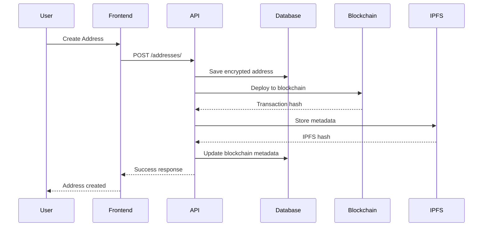
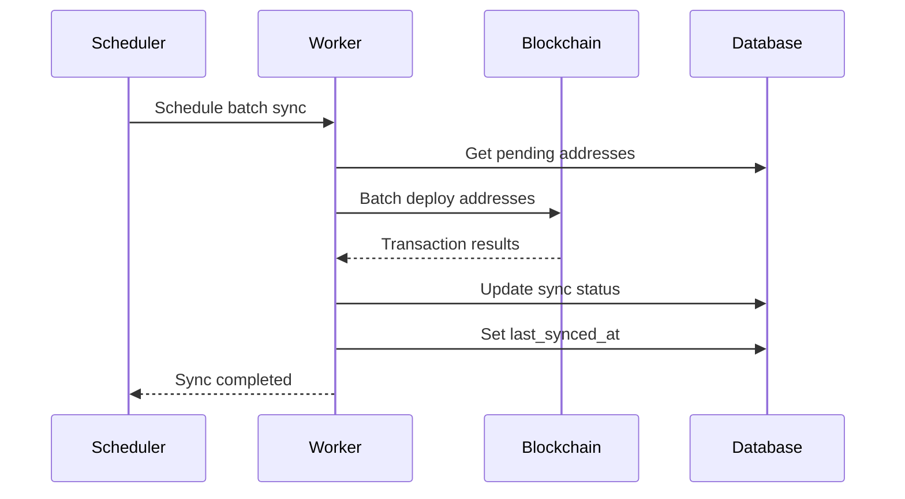
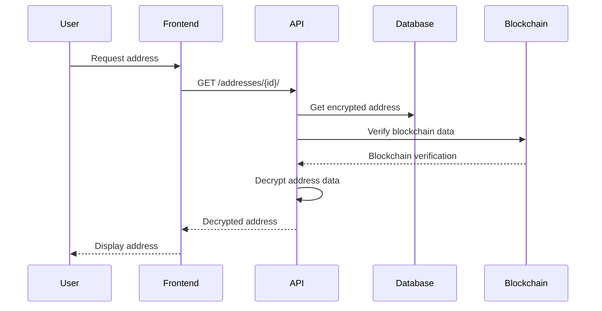

# Blockchain Integration - MyAddressHub

## 6. Blockchain Integration

### 6.1 Smart Contract Architecture

#### 6.1.1 AddressHub Contract Overview

The AddressHub smart contract is the core component of the blockchain integration, providing a decentralized storage solution for address data on the Ethereum/Polygon network.

**Contract Details**:
- **Name**: AddressHub
- **Solidity Version**: ^0.8.0
- **License**: MIT
- **Network**: Hardhat Local (Development), Mumbai Testnet (Testing)
- **Contract Address**: `0x5FbDB2315678afecb367f032d93F642f64180aa3`

#### 6.1.2 Contract Structure

```solidity
// SPDX-License-Identifier: MIT
pragma solidity ^0.8.0;

contract AddressHub {
    struct AddressData {
        string addressName;
        string fullAddress;
        string street;
        string suburb;
        string state;
        string postcode;
        bool isDefault;
        bool isActive;
        uint256 createdAt;
        uint256 updatedAt;
    }
    
    // Mapping: user address => address UUID => AddressData
    mapping(address => mapping(bytes32 => AddressData)) public userAddresses;
    
    // Mapping: user address => array of address UUIDs
    mapping(address => bytes32[]) public userAddressIds;
    
    // Events
    event AddressCreated(address indexed user, bytes32 indexed addressId, string addressName);
    event AddressUpdated(address indexed user, bytes32 indexed addressId);
    event AddressDeleted(address indexed user, bytes32 indexed addressId);
    
    // Modifiers
    modifier onlyAddressOwner(bytes32 addressId) {
        require(userAddresses[msg.sender][addressId].createdAt != 0, "Address does not exist");
        _;
    }
}
```

#### 6.1.3 Contract Functions

**Create Address Function**:
```solidity
function createAddress(
    bytes32 addressId,
    string memory addressName,
    string memory fullAddress,
    string memory street,
    string memory suburb,
    string memory state,
    string memory postcode,
    bool isDefault
) public {
    require(userAddresses[msg.sender][addressId].createdAt == 0, "Address already exists");
    
    // If this is set as default, unset other defaults
    if (isDefault) {
        _unsetOtherDefaults(msg.sender);
    }
    
    userAddresses[msg.sender][addressId] = AddressData({
        addressName: addressName,
        fullAddress: fullAddress,
        street: street,
        suburb: suburb,
        state: state,
        postcode: postcode,
        isDefault: isDefault,
        isActive: true,
        createdAt: block.timestamp,
        updatedAt: block.timestamp
    });
    
    userAddressIds[msg.sender].push(addressId);
    emit AddressCreated(msg.sender, addressId, addressName);
}
```

**Update Address Function**:
```solidity
function updateAddress(
    bytes32 addressId,
    string memory addressName,
    string memory fullAddress,
    string memory street,
    string memory suburb,
    string memory state,
    string memory postcode,
    bool isDefault
) public onlyAddressOwner(addressId) {
    AddressData storage addr = userAddresses[msg.sender][addressId];
    
    // If this is set as default, unset other defaults
    if (isDefault && !addr.isDefault) {
        _unsetOtherDefaults(msg.sender);
    }
    
    addr.addressName = addressName;
    addr.fullAddress = fullAddress;
    addr.street = street;
    addr.suburb = suburb;
    addr.state = state;
    addr.postcode = postcode;
    addr.isDefault = isDefault;
    addr.updatedAt = block.timestamp;
    
    emit AddressUpdated(msg.sender, addressId);
}
```

**Delete Address Function**:
```solidity
function deleteAddress(bytes32 addressId) public onlyAddressOwner(addressId) {
    userAddresses[msg.sender][addressId].isActive = false;
    userAddresses[msg.sender][addressId].updatedAt = block.timestamp;
    emit AddressDeleted(msg.sender, addressId);
}
```

**Read Functions**:
```solidity
function getAddress(bytes32 addressId) public view returns (AddressData memory) {
    return userAddresses[msg.sender][addressId];
}

function getUserAddresses() public view returns (bytes32[] memory) {
    return userAddressIds[msg.sender];
}

function getAddressCount() public view returns (uint256) {
    return userAddressIds[msg.sender].length;
}
```

**Internal Helper Function**:
```solidity
function _unsetOtherDefaults(address user) internal {
    for (uint256 i = 0; i < userAddressIds[user].length; i++) {
        bytes32 addressId = userAddressIds[user][i];
        if (userAddresses[user][addressId].isDefault) {
            userAddresses[user][addressId].isDefault = false;
        }
    }
}
```

### 6.2 Blockchain Integration Flow

#### 6.2.1 Address Creation Flow



#### 6.2.2 Batch Synchronization Flow



#### 6.2.3 Address Retrieval Flow



### 6.3 Web3 Integration

#### 6.3.1 Blockchain Manager Class

```python
# blockchain.py
from web3 import Web3
from eth_account import Account
import json
import os

class BlockchainAddressManager:
    """
    Manages blockchain operations for address storage.
    """
    
    def __init__(self):
        self.w3 = None
        self.contract = None
        self.contract_address = None
        self.abi = None
        self._initialize_connection()
    
    def _initialize_connection(self):
        """Initialize Web3 connection and contract."""
        try:
            # Initialize Web3 connection
            rpc_url = os.getenv('POLYGON_RPC_URL', 'http://localhost:8545')
            self.w3 = Web3(Web3.HTTPProvider(rpc_url))
            
            if not self.w3.is_connected():
                raise ConnectionError("Failed to connect to blockchain")
            
            # Load contract ABI and address
            self.contract_address = os.getenv('ADDRESS_HUB_CONTRACT_ADDRESS')
            self.abi = self._load_contract_abi()
            
            if self.contract_address and self.abi:
                self.contract = self.w3.eth.contract(
                    address=self.contract_address,
                    abi=self.abi
                )
            
            print(f"✅ Blockchain connected: {rpc_url}")
            print(f"✅ Contract address: {self.contract_address}")
            
        except Exception as e:
            print(f"❌ Blockchain connection failed: {e}")
            self.w3 = None
            self.contract = None
    
    def _load_contract_abi(self):
        """Load contract ABI from file."""
        try:
            abi_path = os.path.join(
                os.path.dirname(__file__),
                '..', '..', 'contracts', 'artifacts', 'contracts', 
                'AddressHub.sol', 'AddressHub.json'
            )
            
            with open(abi_path, 'r') as f:
                contract_data = json.load(f)
                return contract_data['abi']
                
        except Exception as e:
            print(f"❌ Failed to load contract ABI: {e}")
            return None
    
    def is_connected(self):
        """Check if blockchain connection is active."""
        return self.w3 is not None and self.w3.is_connected()
    
    def get_network_info(self):
        """Get current network information."""
        if not self.is_connected():
            return None
        
        try:
            return {
                'chain_id': self.w3.eth.chain_id,
                'block_number': self.w3.eth.block_number,
                'gas_price': self.w3.eth.gas_price,
                'is_connected': True
            }
        except Exception as e:
            print(f"❌ Failed to get network info: {e}")
            return None
```

#### 6.3.2 Address Storage on Blockchain

```python
def store_address_on_blockchain(self, address_data: Dict[str, Any], user_wallet: str) -> Dict[str, Any]:
    """
    Store address data on blockchain.
    
    Args:
        address_data: Dictionary containing address information
        user_wallet: User's wallet address
        
    Returns:
        Dictionary with transaction results
    """
    if not self.contract:
        raise ValidationError("Blockchain contract not configured")
    
    try:
        # Convert UUID to bytes32
        uuid_hex = address_data['id'].replace('-', '')
        padded_hex = uuid_hex.zfill(64)
        address_id = self.w3.to_bytes(hexstr=padded_hex)
        
        # Prepare address data
        full_address = f"{address_data.get('address', '')}, {address_data.get('street', '')}, {address_data.get('suburb', '')}, {address_data.get('state', '')} {address_data.get('postcode', '')}"
        
        address_name = str(address_data.get('address_name', ''))
        street = str(address_data.get('street', ''))
        suburb = str(address_data.get('suburb', ''))
        state = str(address_data.get('state', ''))
        postcode = str(address_data.get('postcode', ''))
        is_default = bool(address_data.get('is_default', False))
        
        # Build the transaction
        tx = self.contract.functions.createAddress(
            address_id,
            address_name,
            full_address,
            street,
            suburb,
            state,
            postcode,
            is_default
        ).build_transaction({
            'from': user_wallet,
            'gas': 2000000,
            'gasPrice': self.w3.eth.gas_price,
            'nonce': self.w3.eth.get_transaction_count(user_wallet)
        })
        
        # For development with hardhat, we'll simulate the transaction
        # In production, you would sign and send the transaction
        print(f"Storing address on blockchain: {address_data['id']}")
        print(f"Transaction built: {tx}")
        
        return {
            'success': True,
            'transaction_hash': f"0x{uuid.uuid4().hex}",
            'block_number': self.w3.eth.block_number,
            'message': 'Address stored on blockchain (simulated for development)'
        }
        
    except Exception as e:
        raise ValidationError(f"Failed to store address on blockchain: {str(e)}")
```

#### 6.3.3 Address Retrieval from Blockchain

```python
def get_address_from_blockchain(self, address_id: str, user_wallet: str) -> Dict[str, Any]:
    """
    Retrieve address data from blockchain.
    
    Args:
        address_id: UUID of the address
        user_wallet: User's wallet address
        
    Returns:
        Dictionary with address data
    """
    if not self.contract:
        raise ValidationError("Blockchain contract not configured")
    
    try:
        # Convert UUID to bytes32
        uuid_hex = address_id.replace('-', '')
        padded_hex = uuid_hex.zfill(64)
        address_id_bytes = self.w3.to_bytes(hexstr=padded_hex)
        
        # Call the smart contract
        address_data = self.contract.functions.getAddress(address_id_bytes).call({
            'from': user_wallet
        })
        
        return {
            'success': True,
            'data': {
                'address_id': address_id,
                'address_name': address_data[0],
                'full_address': address_data[1],
                'street': address_data[2],
                'suburb': address_data[3],
                'state': address_data[4],
                'postcode': address_data[5],
                'is_default': address_data[6],
                'is_active': address_data[7],
                'created_at': address_data[8],
                'updated_at': address_data[9]
            }
        }
        
    except Exception as e:
        raise ValidationError(f"Failed to retrieve address from blockchain: {str(e)}")
```

### 6.4 IPFS Integration

#### 6.4.1 IPFS Configuration

```python
# ipfs.py
import ipfshttpclient
import json
import os

class IPFSManager:
    """
    Manages IPFS operations for metadata storage.
    """
    
    def __init__(self):
        self.client = None
        self.api_url = os.getenv('IPFS_API_URL', 'http://localhost:5001')
        self._initialize_connection()
    
    def _initialize_connection(self):
        """Initialize IPFS connection."""
        try:
            self.client = ipfshttpclient.connect(self.api_url)
            print(f"✅ IPFS connected: {self.api_url}")
        except Exception as e:
            print(f"❌ IPFS connection failed: {e}")
            self.client = None
    
    def is_connected(self):
        """Check if IPFS connection is active."""
        return self.client is not None
    
    def store_data(self, data: dict) -> str:
        """
        Store data on IPFS.
        
        Args:
            data: Dictionary to store
            
        Returns:
            IPFS hash of stored data
        """
        if not self.is_connected():
            raise ConnectionError("IPFS not connected")
        
        try:
            # Convert data to JSON
            json_data = json.dumps(data, indent=2)
            
            # Store on IPFS
            result = self.client.add_str(json_data)
            ipfs_hash = result['Hash']
            
            print(f"✅ Data stored on IPFS: {ipfs_hash}")
            return ipfs_hash
            
        except Exception as e:
            raise Exception(f"Failed to store data on IPFS: {e}")
    
    def retrieve_data(self, ipfs_hash: str) -> dict:
        """
        Retrieve data from IPFS.
        
        Args:
            ipfs_hash: IPFS hash of the data
            
        Returns:
            Retrieved data dictionary
        """
        if not self.is_connected():
            raise ConnectionError("IPFS not connected")
        
        try:
            # Retrieve from IPFS
            data = self.client.cat(ipfs_hash)
            json_data = data.decode('utf-8')
            
            return json.loads(json_data)
            
        except Exception as e:
            raise Exception(f"Failed to retrieve data from IPFS: {e}")
```

#### 6.4.2 Metadata Storage

```python
def store_address_metadata(self, address: Address) -> str:
    """
    Store address metadata on IPFS.
    
    Args:
        address: Address model instance
        
    Returns:
        IPFS hash of stored metadata
    """
    metadata = {
        'user_id': address.user.id,
        'user_email': address.user.email,
        'address_id': str(address.id),
        'address_name': address.address_name,
        'created_at': address.created_at.isoformat(),
        'updated_at': address.updated_at.isoformat(),
        'blockchain_tx_hash': address.blockchain_tx_hash,
        'blockchain_block_number': address.blockchain_block_number,
        'is_default': address.is_default,
        'is_active': address.is_active
    }
    
    return self.ipfs_manager.store_data(metadata)
```

### 6.5 Batch Synchronization

#### 6.5.1 Batch Sync Manager

```python
# batch_sync.py
class BatchSyncManager:
    """
    Manages batch synchronization of addresses to blockchain.
    """
    
    def __init__(self, batch_size: int = 10, max_retries: int = 3):
        self.batch_size = batch_size
        self.max_retries = max_retries
        self.blockchain_manager = blockchain_manager
        self.ipfs_manager = IPFSManager()
    
    def get_pending_addresses(self) -> List[Address]:
        """
        Get addresses that need to be synced to blockchain.
        
        Returns:
            List of Address objects that need blockchain sync
        """
        return Address.objects.filter(
            is_active=True,
            is_stored_on_blockchain=False
        ).select_related('user')[:self.batch_size]
    
    def prepare_batch_data(self, addresses: List[Address]) -> List[Dict[str, Any]]:
        """
        Prepare address data for blockchain synchronization.
        
        Args:
            addresses: List of Address objects
            
        Returns:
            List of prepared address data dictionaries
        """
        batch_data = []
        
        for address in addresses:
            try:
                # Decrypt address data
                encrypted_data = {
                    'address': address.address,
                    'street': address.street,
                    'suburb': address.suburb,
                    'state': address.state,
                    'postcode': address.postcode
                }
                
                decrypted_data = decrypt_address_data(encrypted_data)
                
                # Prepare blockchain data
                blockchain_data = {
                    'id': str(address.id),
                    'address_name': address.address_name,
                    'is_default': address.is_default,
                    'is_active': address.is_active,
                    **decrypted_data
                }
                
                # Get user wallet (placeholder for now)
                user_wallet = self._get_user_wallet(address.user)
                
                batch_data.append({
                    'address': address,
                    'data': blockchain_data,
                    'user_wallet': user_wallet
                })
                
            except Exception as e:
                print(f"❌ Failed to prepare address {address.id}: {e}")
                continue
        
        return batch_data
    
    def sync_batch_to_blockchain(self, batch_data: List[Dict[str, Any]]) -> Dict[str, Any]:
        """
        Sync a batch of addresses to blockchain.
        
        Args:
            batch_data: List of address data dictionaries
            
        Returns:
            Dictionary with sync results
        """
        if not self.blockchain_manager.is_connected():
            return {
                'success': False,
                'error': 'Blockchain not connected',
                'processed': 0,
                'failed': len(batch_data)
            }
        
        results = {
            'success': True,
            'processed': 0,
            'failed': 0,
            'errors': []
        }
        
        for item in batch_data:
            try:
                address = item['address']
                address_data = item['data']
                user_wallet = item['user_wallet']
                
                # Store on blockchain
                result = self.blockchain_manager.store_address_on_blockchain(address_data, user_wallet)
                
                if result.get('success'):
                    # Store metadata on IPFS
                    ipfs_hash = self.ipfs_manager.store_address_metadata(address)
                    
                    # Update address with blockchain metadata
                    with transaction.atomic():
                        from django.utils import timezone
                        address.blockchain_tx_hash = result.get('transaction_hash')
                        address.blockchain_block_number = result.get('block_number')
                        address.is_stored_on_blockchain = True
                        address.last_synced_at = timezone.now()
                        address.ipfs_hash = ipfs_hash
                        address.save(update_fields=[
                            'blockchain_tx_hash',
                            'blockchain_block_number',
                            'is_stored_on_blockchain',
                            'last_synced_at',
                            'ipfs_hash'
                        ])
                    
                    results['processed'] += 1
                    print(f"✅ Synced address {address.id} to blockchain")
                    
                else:
                    results['failed'] += 1
                    results['errors'].append(f"Address {address.id}: {result.get('error', 'Unknown error')}")
                    
            except Exception as e:
                results['failed'] += 1
                results['errors'].append(f"Address {address.id}: {str(e)}")
                print(f"❌ Failed to sync address {address.id}: {e}")
        
        if results['failed'] > 0:
            results['success'] = False
        
        return results
```

#### 6.5.2 Celery Tasks for Batch Sync

```python
# tasks.py
from celery import shared_task
from celery.exceptions import Retry
from django.db import transaction
from typing import List, Dict, Any
from .models import Address
from .batch_sync import BatchSyncManager

@shared_task(bind=True, max_retries=3, default_retry_delay=60)
def sync_addresses_to_blockchain(self, batch_size: int = 10):
    """
    Celery task to sync new addresses to blockchain in batches.
    """
    try:
        sync_manager = BatchSyncManager(batch_size=batch_size)
        pending_addresses = sync_manager.get_pending_addresses()
        
        if not pending_addresses:
            return {
                'success': True,
                'message': 'No new addresses to sync',
                'processed': 0,
                'failed': 0
            }
        
        batch_data = sync_manager.prepare_batch_data(pending_addresses)
        results = sync_manager.sync_batch_to_blockchain(batch_data)
        
        if not results['success'] and self.request.retries < self.max_retries:
            raise Retry(countdown=60 * (2 ** self.request.retries))
        
        return results
        
    except Exception as e:
        print(f"Batch sync error: {e}")
        if self.request.retries < self.max_retries:
            raise Retry(countdown=60 * (2 ** self.request.retries))
        return {
            'success': False,
            'error': str(e),
            'processed': 0,
            'failed': batch_size
        }

@shared_task
def schedule_batch_sync():
    """
    Schedule batch synchronization tasks.
    This should be called by Celery Beat periodically.
    """
    try:
        # Using BatchSyncManager to get counts
        sync_manager = BatchSyncManager(batch_size=10)
        pending_count = Address.objects.filter(
            is_active=True,
            is_stored_on_blockchain=False
        ).count()
        
        if pending_count > 0:
            sync_addresses_to_blockchain.delay(batch_size=10)
            print(f"Queued batch sync for {pending_count} pending addresses")
        
        return {
            'success': True,
            'pending_synced': pending_count
        }
        
    except Exception as e:
        print(f"Error scheduling batch sync: {e}")
        return {
            'success': False,
            'error': str(e)
        }
```

### 6.6 Network Configuration

#### 6.6.1 Development Network (Hardhat)

```javascript
// hardhat.config.js
require("@nomicfoundation/hardhat-toolbox");

module.exports = {
  solidity: "0.8.19",
  networks: {
    hardhat: {
      chainId: 31337,
      accounts: {
        mnemonic: "test test test test test test test test test test test junk",
        count: 20,
        accountsBalance: "10000000000000000000000"
      }
    },
    localhost: {
      url: "http://localhost:8545",
      chainId: 31337
    }
  },
  paths: {
    sources: "./contracts",
    tests: "./test",
    cache: "./cache",
    artifacts: "./artifacts"
  }
};
```

#### 6.6.2 Testnet Network (Mumbai)

```javascript
// hardhat.config.js
module.exports = {
  networks: {
    mumbai: {
      url: process.env.MUMBAI_RPC_URL || "https://polygon-mumbai.infura.io/v3/YOUR_PROJECT_ID",
      accounts: process.env.PRIVATE_KEY ? [process.env.PRIVATE_KEY] : [],
      chainId: 80001,
      gasPrice: "auto"
    }
  }
};
```

#### 6.6.3 Contract Deployment

```javascript
// deploy.js
const { ethers } = require("hardhat");

async function main() {
  console.log("Deploying AddressHub contract...");
  
  const AddressHub = await ethers.getContractFactory("AddressHub");
  const addressHub = await AddressHub.deploy();
  
  await addressHub.deployed();
  
  console.log("AddressHub deployed to:", addressHub.address);
  
  // Save deployment info
  const deploymentInfo = {
    contractAddress: addressHub.address,
    network: network.name,
    deployer: await addressHub.signer.getAddress(),
    timestamp: new Date().toISOString()
  };
  
  const fs = require('fs');
  fs.writeFileSync('deployment.json', JSON.stringify(deploymentInfo, null, 2));
  
  console.log("Deployment info saved to deployment.json");
}

main()
  .then(() => process.exit(0))
  .catch((error) => {
    console.error(error);
    process.exit(1);
  });
```

### 6.7 Testing Smart Contracts

#### 6.7.1 Contract Unit Tests

```javascript
// test/AddressHub.test.js
const { expect } = require("chai");
const { ethers } = require("hardhat");

describe("AddressHub", function () {
  let addressHub;
  let owner;
  let addr1;
  let addr2;

  beforeEach(async function () {
    [owner, addr1, addr2] = await ethers.getSigners();
    const AddressHub = await ethers.getContractFactory("AddressHub");
    addressHub = await AddressHub.deploy();
    await addressHub.deployed();
  });

  describe("Address Creation", function () {
    it("Should create an address", async function () {
      const addressId = ethers.utils.keccak256(ethers.utils.toUtf8Bytes("test-address"));
      
      await addressHub.createAddress(
        addressId,
        "Home",
        "123 Main St, City, State 12345",
        "Main St",
        "City",
        "State",
        "12345",
        true
      );

      const address = await addressHub.getAddress(addressId);
      expect(address.addressName).to.equal("Home");
      expect(address.isDefault).to.be.true;
      expect(address.isActive).to.be.true;
    });

    it("Should emit AddressCreated event", async function () {
      const addressId = ethers.utils.keccak256(ethers.utils.toUtf8Bytes("test-address"));
      
      await expect(
        addressHub.createAddress(
          addressId,
          "Home",
          "123 Main St, City, State 12345",
          "Main St",
          "City",
          "State",
          "12345",
          true
        )
      ).to.emit(addressHub, "AddressCreated")
        .withArgs(owner.address, addressId, "Home");
    });

    it("Should not allow duplicate address IDs", async function () {
      const addressId = ethers.utils.keccak256(ethers.utils.toUtf8Bytes("test-address"));
      
      await addressHub.createAddress(
        addressId,
        "Home",
        "123 Main St, City, State 12345",
        "Main St",
        "City",
        "State",
        "12345",
        true
      );

      await expect(
        addressHub.createAddress(
          addressId,
          "Work",
          "456 Work St, City, State 12345",
          "Work St",
          "City",
          "State",
          "12345",
          false
        )
      ).to.be.revertedWith("Address already exists");
    });
  });

  describe("Address Updates", function () {
    it("Should update an address", async function () {
      const addressId = ethers.utils.keccak256(ethers.utils.toUtf8Bytes("test-address"));
      
      // Create address
      await addressHub.createAddress(
        addressId,
        "Home",
        "123 Main St, City, State 12345",
        "Main St",
        "City",
        "State",
        "12345",
        true
      );

      // Update address
      await addressHub.updateAddress(
        addressId,
        "Updated Home",
        "789 New St, New City, New State 54321",
        "New St",
        "New City",
        "New State",
        "54321",
        false
      );

      const address = await addressHub.getAddress(addressId);
      expect(address.addressName).to.equal("Updated Home");
      expect(address.isDefault).to.be.false;
    });
  });

  describe("Address Deletion", function () {
    it("Should soft delete an address", async function () {
      const addressId = ethers.utils.keccak256(ethers.utils.toUtf8Bytes("test-address"));
      
      // Create address
      await addressHub.createAddress(
        addressId,
        "Home",
        "123 Main St, City, State 12345",
        "Main St",
        "City",
        "State",
        "12345",
        true
      );

      // Delete address
      await addressHub.deleteAddress(addressId);

      const address = await addressHub.getAddress(addressId);
      expect(address.isActive).to.be.false;
    });
  });

  describe("User Address Management", function () {
    it("Should return user's addresses", async function () {
      const addressId1 = ethers.utils.keccak256(ethers.utils.toUtf8Bytes("address-1"));
      const addressId2 = ethers.utils.keccak256(ethers.utils.toUtf8Bytes("address-2"));
      
      // Create addresses
      await addressHub.createAddress(
        addressId1,
        "Home",
        "123 Main St, City, State 12345",
        "Main St",
        "City",
        "State",
        "12345",
        true
      );

      await addressHub.createAddress(
        addressId2,
        "Work",
        "456 Work St, City, State 12345",
        "Work St",
        "City",
        "State",
        "12345",
        false
      );

      const userAddresses = await addressHub.getUserAddresses();
      expect(userAddresses).to.have.lengthOf(2);
      expect(userAddresses[0]).to.equal(addressId1);
      expect(userAddresses[1]).to.equal(addressId2);
    });

    it("Should return correct address count", async function () {
      const addressId = ethers.utils.keccak256(ethers.utils.toUtf8Bytes("test-address"));
      
      expect(await addressHub.getAddressCount()).to.equal(0);
      
      await addressHub.createAddress(
        addressId,
        "Home",
        "123 Main St, City, State 12345",
        "Main St",
        "City",
        "State",
        "12345",
        true
      );

      expect(await addressHub.getAddressCount()).to.equal(1);
    });
  });
});
```

### 6.8 Gas Optimization

#### 6.8.1 Gas-Efficient Data Structures

```solidity
// Optimized struct packing
struct AddressData {
    // Packed into single storage slot
    uint128 createdAt;
    uint128 updatedAt;
    bool isDefault;
    bool isActive;
    
    // String data (stored separately)
    string addressName;
    string fullAddress;
    string street;
    string suburb;
    string state;
    string postcode;
}
```

#### 6.8.2 Batch Operations

```solidity
// Batch address creation
function createAddressesBatch(
    bytes32[] memory addressIds,
    string[] memory addressNames,
    string[] memory fullAddresses,
    string[] memory streets,
    string[] memory suburbs,
    string[] memory states,
    string[] memory postcodes,
    bool[] memory isDefaults
) public {
    require(addressIds.length == addressNames.length, "Array length mismatch");
    
    for (uint256 i = 0; i < addressIds.length; i++) {
        createAddress(
            addressIds[i],
            addressNames[i],
            fullAddresses[i],
            streets[i],
            suburbs[i],
            states[i],
            postcodes[i],
            isDefaults[i]
        );
    }
}
```

---

*This section provides comprehensive blockchain integration documentation including smart contract architecture, Web3 integration, IPFS storage, batch synchronization, and testing strategies.*
