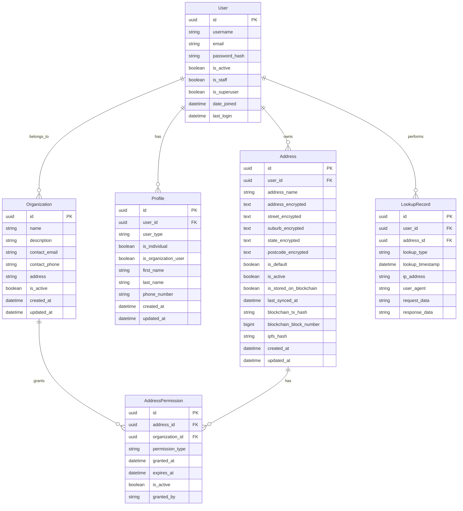

# Database Design - MyAddressHub

## 4. Database Design

### 4.1 Entity Relationship Diagram



### 4.2 Database Schema Details

#### 4.2.1 Core Tables

**Users Table (`auth_user`)**
```sql
CREATE TABLE auth_user (
    id SERIAL PRIMARY KEY,
    username VARCHAR(150) UNIQUE NOT NULL,
    email VARCHAR(254) UNIQUE NOT NULL,
    password VARCHAR(128) NOT NULL,
    first_name VARCHAR(150) NOT NULL,
    last_name VARCHAR(150) NOT NULL,
    is_active BOOLEAN NOT NULL DEFAULT TRUE,
    is_staff BOOLEAN NOT NULL DEFAULT FALSE,
    is_superuser BOOLEAN NOT NULL DEFAULT FALSE,
    date_joined TIMESTAMP WITH TIME ZONE NOT NULL DEFAULT NOW(),
    last_login TIMESTAMP WITH TIME ZONE
);

-- Indexes
CREATE INDEX idx_auth_user_email ON auth_user(email);
CREATE INDEX idx_auth_user_username ON auth_user(username);
CREATE INDEX idx_auth_user_is_active ON auth_user(is_active);
```

**Profiles Table (`accounts_profile`)**
```sql
CREATE TABLE accounts_profile (
    id UUID PRIMARY KEY DEFAULT gen_random_uuid(),
    user_id INTEGER NOT NULL REFERENCES auth_user(id) ON DELETE CASCADE,
    user_type VARCHAR(20) NOT NULL CHECK (user_type IN ('individual', 'organization')),
    is_individual BOOLEAN NOT NULL DEFAULT FALSE,
    is_organization_user BOOLEAN NOT NULL DEFAULT FALSE,
    first_name VARCHAR(150),
    last_name VARCHAR(150),
    phone_number VARCHAR(20),
    created_at TIMESTAMP WITH TIME ZONE NOT NULL DEFAULT NOW(),
    updated_at TIMESTAMP WITH TIME ZONE NOT NULL DEFAULT NOW(),
    
    CONSTRAINT unique_user_profile UNIQUE (user_id)
);

-- Indexes
CREATE INDEX idx_accounts_profile_user_id ON accounts_profile(user_id);
CREATE INDEX idx_accounts_profile_user_type ON accounts_profile(user_type);
CREATE INDEX idx_accounts_profile_is_individual ON accounts_profile(is_individual);
```

**Addresses Table (`addresses`)**
```sql
CREATE TABLE addresses (
    id UUID PRIMARY KEY DEFAULT gen_random_uuid(),
    user_id INTEGER NOT NULL REFERENCES auth_user(id) ON DELETE CASCADE,
    address_name VARCHAR(255) NOT NULL,
    
    -- Encrypted address fields
    address TEXT,
    street TEXT,
    suburb TEXT,
    state TEXT,
    postcode TEXT,
    
    -- Blockchain metadata
    blockchain_tx_hash VARCHAR(66),
    blockchain_block_number BIGINT,
    ipfs_hash VARCHAR(100),
    is_stored_on_blockchain BOOLEAN NOT NULL DEFAULT FALSE,
    last_synced_at TIMESTAMP WITH TIME ZONE,
    
    -- Status fields
    is_default BOOLEAN NOT NULL DEFAULT FALSE,
    is_active BOOLEAN NOT NULL DEFAULT TRUE,
    
    -- Timestamps
    created_at TIMESTAMP WITH TIME ZONE NOT NULL DEFAULT NOW(),
    updated_at TIMESTAMP WITH TIME ZONE NOT NULL DEFAULT NOW(),
    
    -- Constraints
    CONSTRAINT unique_default_address_per_user UNIQUE (user_id, is_default) 
        DEFERRABLE INITIALLY DEFERRED
);

-- Indexes
CREATE INDEX idx_addresses_user_id ON addresses(user_id);
CREATE INDEX idx_addresses_is_active ON addresses(is_active);
CREATE INDEX idx_addresses_is_stored_on_blockchain ON addresses(is_stored_on_blockchain);
CREATE INDEX idx_addresses_created_at ON addresses(created_at);
CREATE INDEX idx_addresses_last_synced_at ON addresses(last_synced_at);
CREATE INDEX idx_addresses_blockchain_tx_hash ON addresses(blockchain_tx_hash);

-- Composite indexes
CREATE INDEX idx_addresses_user_active ON addresses(user_id, is_active);
CREATE INDEX idx_addresses_user_default ON addresses(user_id, is_default);
CREATE INDEX idx_addresses_user_blockchain ON addresses(user_id, is_stored_on_blockchain);
```

**Organizations Table (`accounts_organization`)**
```sql
CREATE TABLE accounts_organization (
    id UUID PRIMARY KEY DEFAULT gen_random_uuid(),
    name VARCHAR(255) NOT NULL,
    description TEXT,
    contact_email VARCHAR(254),
    contact_phone VARCHAR(20),
    address TEXT,
    is_active BOOLEAN NOT NULL DEFAULT TRUE,
    created_at TIMESTAMP WITH TIME ZONE NOT NULL DEFAULT NOW(),
    updated_at TIMESTAMP WITH TIME ZONE NOT NULL DEFAULT NOW()
);

-- Indexes
CREATE INDEX idx_accounts_organization_name ON accounts_organization(name);
CREATE INDEX idx_accounts_organization_is_active ON accounts_organization(is_active);
CREATE INDEX idx_accounts_organization_contact_email ON accounts_organization(contact_email);
```

**Address Permissions Table (`accounts_addresspermission`)**
```sql
CREATE TABLE accounts_addresspermission (
    id UUID PRIMARY KEY DEFAULT gen_random_uuid(),
    address_id UUID NOT NULL REFERENCES addresses(id) ON DELETE CASCADE,
    organization_id UUID NOT NULL REFERENCES accounts_organization(id) ON DELETE CASCADE,
    permission_type VARCHAR(20) NOT NULL CHECK (permission_type IN ('read', 'write', 'admin')),
    granted_at TIMESTAMP WITH TIME ZONE NOT NULL DEFAULT NOW(),
    expires_at TIMESTAMP WITH TIME ZONE,
    is_active BOOLEAN NOT NULL DEFAULT TRUE,
    granted_by INTEGER REFERENCES auth_user(id),
    
    CONSTRAINT unique_address_organization_permission UNIQUE (address_id, organization_id)
);

-- Indexes
CREATE INDEX idx_accounts_addresspermission_address_id ON accounts_addresspermission(address_id);
CREATE INDEX idx_accounts_addresspermission_organization_id ON accounts_addresspermission(organization_id);
CREATE INDEX idx_accounts_addresspermission_permission_type ON accounts_addresspermission(permission_type);
CREATE INDEX idx_accounts_addresspermission_is_active ON accounts_addresspermission(is_active);
CREATE INDEX idx_accounts_addresspermission_expires_at ON accounts_addresspermission(expires_at);
```

**Lookup Records Table (`accounts_lookuprecord`)**
```sql
CREATE TABLE accounts_lookuprecord (
    id UUID PRIMARY KEY DEFAULT gen_random_uuid(),
    user_id INTEGER NOT NULL REFERENCES auth_user(id) ON DELETE CASCADE,
    address_id UUID NOT NULL REFERENCES addresses(id) ON DELETE CASCADE,
    lookup_type VARCHAR(50) NOT NULL,
    lookup_timestamp TIMESTAMP WITH TIME ZONE NOT NULL DEFAULT NOW(),
    ip_address INET,
    user_agent TEXT,
    request_data JSONB,
    response_data JSONB
);

-- Indexes
CREATE INDEX idx_accounts_lookuprecord_user_id ON accounts_lookuprecord(user_id);
CREATE INDEX idx_accounts_lookuprecord_address_id ON accounts_lookuprecord(address_id);
CREATE INDEX idx_accounts_lookuprecord_lookup_type ON accounts_lookuprecord(lookup_type);
CREATE INDEX idx_accounts_lookuprecord_lookup_timestamp ON accounts_lookuprecord(lookup_timestamp);
CREATE INDEX idx_accounts_lookuprecord_ip_address ON accounts_lookuprecord(ip_address);
```

### 4.3 Data Encryption Implementation

#### 4.3.1 Encryption Strategy

**Algorithm**: Fernet (AES 128 in CBC mode with HMAC-SHA256)
**Key Derivation**: PBKDF2 with SHA-256
**Iterations**: 100,000
**Salt**: 32-byte random salt

```python
# Encryption configuration
ENCRYPTION_CONFIG = {
    'algorithm': 'fernet',
    'key_derivation': 'pbkdf2',
    'iterations': 100000,
    'salt_length': 32,
    'key_length': 32,
    'fields_to_encrypt': [
        'address',
        'street', 
        'suburb',
        'state',
        'postcode'
    ]
}
```

#### 4.3.2 Encrypted Fields

| Field | Encryption Status | Purpose | Example |
|-------|------------------|---------|---------|
| `address` | Encrypted | Street address line | "123 Main Street" |
| `street` | Encrypted | Street name | "Main Street" |
| `suburb` | Encrypted | Suburb/city name | "Downtown" |
| `state` | Encrypted | State/province | "NSW" |
| `postcode` | Encrypted | Postal code | "2000" |
| `address_name` | Plain text | User-friendly name | "Home" |
| `is_default` | Plain text | Boolean flag | true |
| `is_active` | Plain text | Boolean flag | true |

#### 4.3.3 Encryption Process

```python
def encrypt_address_data(address_data: dict) -> dict:
    """
    Encrypt address data for database storage.
    
    Args:
        address_data: Dictionary containing address fields
        
    Returns:
        Dictionary with encrypted address fields
    """
    fields_to_encrypt = ['address', 'street', 'suburb', 'state', 'postcode']
    
    encrypted_data = {}
    for key, value in address_data.items():
        if key in fields_to_encrypt and isinstance(value, str) and value:
            encrypted_data[key] = address_encryption.encrypt(value)
        else:
            encrypted_data[key] = value
    
    return encrypted_data
```

### 4.4 Database Constraints and Validation

#### 4.4.1 Business Rules

**Address Constraints**
- Only one default address per user
- Address name must be unique per user
- All address fields cannot be empty simultaneously
- Blockchain transaction hash must be unique

**User Constraints**
- Email must be unique across all users
- Username must be unique across all users
- Profile must exist for each user
- User type must be either 'individual' or 'organization'

**Permission Constraints**
- Address permission must be unique per address-organization pair
- Permission expiration date must be in the future
- Only active permissions are considered valid

#### 4.4.2 Data Validation

```python
# Django model validation
class Address(models.Model):
    def clean(self):
        # Validate that at least one address field is provided
        address_fields = [self.address, self.street, self.suburb, self.state, self.postcode]
        if not any(field for field in address_fields):
            raise ValidationError("At least one address field must be provided.")
        
        # Validate address name uniqueness per user
        if self.address_name and self.user:
            existing = Address.objects.filter(
                user=self.user, 
                address_name=self.address_name
            ).exclude(pk=self.pk)
            if existing.exists():
                raise ValidationError("Address name must be unique per user.")
```

### 4.5 Database Performance Optimization

#### 4.5.1 Indexing Strategy

**Primary Indexes**
```sql
-- User table indexes
CREATE INDEX idx_auth_user_email ON auth_user(email);
CREATE INDEX idx_auth_user_username ON auth_user(username);
CREATE INDEX idx_auth_user_is_active ON auth_user(is_active);

-- Address table indexes
CREATE INDEX idx_addresses_user_id ON addresses(user_id);
CREATE INDEX idx_addresses_is_active ON addresses(is_active);
CREATE INDEX idx_addresses_is_stored_on_blockchain ON addresses(is_stored_on_blockchain);
CREATE INDEX idx_addresses_created_at ON addresses(created_at);
CREATE INDEX idx_addresses_last_synced_at ON addresses(last_synced_at);
CREATE INDEX idx_addresses_blockchain_tx_hash ON addresses(blockchain_tx_hash);
```

**Composite Indexes**
```sql
-- Optimize common query patterns
CREATE INDEX idx_addresses_user_active ON addresses(user_id, is_active);
CREATE INDEX idx_addresses_user_default ON addresses(user_id, is_default);
CREATE INDEX idx_addresses_user_blockchain ON addresses(user_id, is_stored_on_blockchain);
CREATE INDEX idx_addresses_active_blockchain ON addresses(is_active, is_stored_on_blockchain);
```

#### 4.5.2 Query Optimization

**Common Query Patterns**
```sql
-- Get user's active addresses
SELECT * FROM addresses 
WHERE user_id = ? AND is_active = true 
ORDER BY created_at DESC;

-- Get addresses pending blockchain sync
SELECT * FROM addresses 
WHERE is_active = true AND is_stored_on_blockchain = false 
ORDER BY created_at ASC 
LIMIT 10;

-- Get user's default address
SELECT * FROM addresses 
WHERE user_id = ? AND is_default = true AND is_active = true;
```

### 4.6 Database Migration Strategy

#### 4.6.1 Migration Files

**Initial Migration (0001_initial.py)**
```python
from django.db import migrations, models
import uuid

class Migration(migrations.Migration):
    initial = True
    
    dependencies = [
        ('auth', '0012_alter_user_first_name_max_length'),
    ]
    
    operations = [
        migrations.CreateModel(
            name='Address',
            fields=[
                ('id', models.UUIDField(default=uuid.uuid4, editable=False, primary_key=True, serialize=False)),
                ('address_name', models.CharField(max_length=255)),
                ('address', models.TextField(blank=True, null=True)),
                ('street', models.TextField(blank=True, null=True)),
                ('suburb', models.TextField(blank=True, null=True)),
                ('state', models.TextField(blank=True, null=True)),
                ('postcode', models.TextField(blank=True, null=True)),
                ('is_default', models.BooleanField(default=False)),
                ('is_active', models.BooleanField(default=True)),
                ('created_at', models.DateTimeField(auto_now_add=True)),
                ('updated_at', models.DateTimeField(auto_now=True)),
                ('user', models.ForeignKey(on_delete=models.CASCADE, related_name='addresses', to='auth.user')),
            ],
        ),
    ]
```

**Blockchain Integration Migration (0005_add_blockchain_storage_fields.py)**
```python
class Migration(migrations.Migration):
    dependencies = [
        ('addresses', '0004_remove_blockchain_fields'),
    ]
    
    operations = [
        migrations.AddField(
            model_name='address',
            name='blockchain_tx_hash',
            field=models.CharField(blank=True, max_length=66, null=True),
        ),
        migrations.AddField(
            model_name='address',
            name='blockchain_block_number',
            field=models.BigIntegerField(blank=True, null=True),
        ),
        migrations.AddField(
            model_name='address',
            name='ipfs_hash',
            field=models.CharField(blank=True, max_length=100, null=True),
        ),
        migrations.AddField(
            model_name='address',
            name='is_stored_on_blockchain',
            field=models.BooleanField(default=False),
        ),
    ]
```

**Last Sync Timestamp Migration (0007_add_last_synced_at_field.py)**
```python
class Migration(migrations.Migration):
    dependencies = [
        ('addresses', '0006_encrypt_address_fields'),
    ]
    
    operations = [
        migrations.AddField(
            model_name='address',
            name='last_synced_at',
            field=models.DateTimeField(blank=True, null=True),
        ),
    ]
```

### 4.7 Database Backup and Recovery

#### 4.7.1 Backup Strategy

**Automated Backups**
```bash
#!/bin/bash
# Daily database backup script

BACKUP_DIR="/backups/postgresql"
DATE=$(date +%Y%m%d_%H%M%S)
DB_NAME="MyAddressHub"
DB_USER="MyAddressHub"

# Create backup directory
mkdir -p $BACKUP_DIR

# Create database backup
pg_dump -h localhost -U $DB_USER -d $DB_NAME \
    --format=custom \
    --compress=9 \
    --file="$BACKUP_DIR/backup_$DATE.dump"

# Keep only last 30 days of backups
find $BACKUP_DIR -name "backup_*.dump" -mtime +30 -delete

echo "Backup completed: backup_$DATE.dump"
```

**Recovery Process**
```bash
# Restore from backup
pg_restore -h localhost -U MyAddressHub -d MyAddressHub \
    --clean \
    --if-exists \
    --verbose \
    backup_20250913_120000.dump
```

#### 4.7.2 Data Integrity

**Regular Integrity Checks**
```sql
-- Check for orphaned records
SELECT COUNT(*) FROM addresses a 
LEFT JOIN auth_user u ON a.user_id = u.id 
WHERE u.id IS NULL;

-- Check for duplicate default addresses
SELECT user_id, COUNT(*) 
FROM addresses 
WHERE is_default = true AND is_active = true 
GROUP BY user_id 
HAVING COUNT(*) > 1;

-- Check for invalid blockchain references
SELECT COUNT(*) FROM addresses 
WHERE is_stored_on_blockchain = true 
AND (blockchain_tx_hash IS NULL OR blockchain_block_number IS NULL);
```

---

*This section provides comprehensive database design documentation including schema details, encryption implementation, performance optimization, and backup strategies.*
