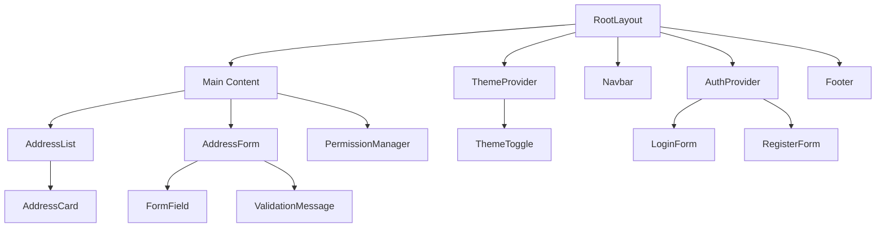

# Frontend Architecture - MyAddressHub

## 8. Frontend Architecture

### 8.1 Next.js Application Structure

```
app/
├── src/
│   ├── app/                    # App Router pages
│   │   ├── about/             # About page
│   │   ├── addresses/         # Address management
│   │   ├── auth/              # Authentication pages
│   │   ├── features/          # Features page
│   │   ├── org-dashboard/     # Organization dashboard
│   │   ├── layout.tsx         # Root layout
│   │   ├── page.tsx           # Home page
│   │   └── not-found.tsx      # 404 page
│   ├── components/            # Reusable components
│   │   ├── AddressForm.tsx    # Address creation/editing
│   │   ├── AddressList.tsx    # Address listing
│   │   ├── Footer.tsx         # Site footer
│   │   ├── Navbar.tsx         # Navigation bar
│   │   ├── PermissionManager.tsx # Permission management
│   │   ├── ThemeProvider.tsx  # Theme context
│   │   └── Toast.tsx          # Notification component
│   ├── contexts/              # React contexts
│   │   └── NotificationContext.tsx # Global notifications
│   ├── lib/                   # Utility libraries
│   │   ├── api.ts             # API client
│   │   ├── auth.tsx           # Authentication context
│   │   └── config.ts          # App configuration
│   └── styles/                # Styling
│       └── globals.css        # Global styles
├── public/                    # Static assets
├── package.json               # Dependencies
├── tailwind.config.js         # Tailwind configuration
├── tsconfig.json              # TypeScript configuration
└── next.config.js             # Next.js configuration
```

### 8.2 Technology Stack

#### 8.2.1 Core Technologies

| Component | Technology | Version | Purpose |
|-----------|------------|---------|---------|
| **Framework** | Next.js | 14.1.0 | React framework with SSR |
| **Language** | TypeScript | 5.3.3 | Type-safe JavaScript |
| **Styling** | Tailwind CSS | 3.4.1 | Utility-first CSS framework |
| **UI Components** | Radix UI | Latest | Accessible component library |
| **State Management** | React Context | Built-in | Global state management |
| **HTTP Client** | Axios | 1.6.7 | API communication |
| **Data Fetching** | SWR | 2.2.4 | Data fetching and caching |
| **Form Handling** | React Hook Form | 7.50.1 | Form validation and management |

#### 8.2.2 Package Dependencies

```json
{
  "dependencies": {
    "@heroicons/react": "^2.2.0",
    "@hookform/resolvers": "^3.3.4",
    "@radix-ui/react-avatar": "^1.0.4",
    "@radix-ui/react-dialog": "^1.0.5",
    "@radix-ui/react-dropdown-menu": "^2.0.6",
    "@radix-ui/react-label": "^2.0.2",
    "@radix-ui/react-slot": "^1.0.2",
    "@radix-ui/react-toast": "^1.1.5",
    "axios": "^1.6.7",
    "class-variance-authority": "^0.7.0",
    "clsx": "^2.1.0",
    "humps": "^2.0.1",
    "lucide-react": "^0.330.0",
    "next": "14.1.0",
    "next-themes": "^0.2.1",
    "react": "^18.2.0",
    "react-dom": "^18.2.0",
    "react-hook-form": "^7.50.1",
    "swr": "^2.2.4",
    "tailwind-merge": "^2.2.1",
    "tailwindcss-animate": "^1.0.7",
    "zod": "^3.22.4"
  }
}
```

### 8.3 Component Architecture

#### 8.3.1 Component Hierarchy



#### 8.3.2 Key Components

**AddressForm Component**:
```typescript
// components/AddressForm.tsx
import { useForm } from 'react-hook-form';
import { zodResolver } from '@hookform/resolvers/zod';
import { z } from 'zod';

const addressSchema = z.object({
  address_name: z.string().min(2, 'Address name must be at least 2 characters'),
  address: z.string().optional(),
  street: z.string().optional(),
  suburb: z.string().optional(),
  state: z.string().optional(),
  postcode: z.string().optional(),
  is_default: z.boolean().default(false),
}).refine(
  (data) => data.address || data.street || data.suburb || data.state || data.postcode,
  {
    message: "At least one address field must be provided",
    path: ["address"],
  }
);

type AddressFormData = z.infer<typeof addressSchema>;

interface AddressFormProps {
  initialData?: Partial<AddressFormData>;
  onSubmit: (data: AddressFormData) => Promise<void>;
  isLoading?: boolean;
}

export function AddressForm({ initialData, onSubmit, isLoading }: AddressFormProps) {
  const {
    register,
    handleSubmit,
    formState: { errors },
    watch,
  } = useForm<AddressFormData>({
    resolver: zodResolver(addressSchema),
    defaultValues: initialData,
  });

  const watchedFields = watch();

  return (
    <form onSubmit={handleSubmit(onSubmit)} className="space-y-6">
      <div>
        <label htmlFor="address_name" className="block text-sm font-medium text-gray-700">
          Address Name *
        </label>
        <input
          {...register('address_name')}
          type="text"
          className="mt-1 block w-full rounded-md border-gray-300 shadow-sm focus:border-indigo-500 focus:ring-indigo-500"
        />
        {errors.address_name && (
          <p className="mt-1 text-sm text-red-600">{errors.address_name.message}</p>
        )}
      </div>

      <div className="grid grid-cols-1 gap-6 sm:grid-cols-2">
        <div>
          <label htmlFor="address" className="block text-sm font-medium text-gray-700">
            Address Line
          </label>
          <input
            {...register('address')}
            type="text"
            className="mt-1 block w-full rounded-md border-gray-300 shadow-sm focus:border-indigo-500 focus:ring-indigo-500"
          />
        </div>

        <div>
          <label htmlFor="street" className="block text-sm font-medium text-gray-700">
            Street
          </label>
          <input
            {...register('street')}
            type="text"
            className="mt-1 block w-full rounded-md border-gray-300 shadow-sm focus:border-indigo-500 focus:ring-indigo-500"
          />
        </div>

        <div>
          <label htmlFor="suburb" className="block text-sm font-medium text-gray-700">
            Suburb
          </label>
          <input
            {...register('suburb')}
            type="text"
            className="mt-1 block w-full rounded-md border-gray-300 shadow-sm focus:border-indigo-500 focus:ring-indigo-500"
          />
        </div>

        <div>
          <label htmlFor="state" className="block text-sm font-medium text-gray-700">
            State
          </label>
          <input
            {...register('state')}
            type="text"
            className="mt-1 block w-full rounded-md border-gray-300 shadow-sm focus:border-indigo-500 focus:ring-indigo-500"
          />
        </div>

        <div>
          <label htmlFor="postcode" className="block text-sm font-medium text-gray-700">
            Postcode
          </label>
          <input
            {...register('postcode')}
            type="text"
            className="mt-1 block w-full rounded-md border-gray-300 shadow-sm focus:border-indigo-500 focus:ring-indigo-500"
          />
        </div>
      </div>

      <div className="flex items-center">
        <input
          {...register('is_default')}
          type="checkbox"
          className="h-4 w-4 text-indigo-600 focus:ring-indigo-500 border-gray-300 rounded"
        />
        <label htmlFor="is_default" className="ml-2 block text-sm text-gray-900">
          Set as default address
        </label>
      </div>

      <div className="flex justify-end space-x-3">
        <button
          type="button"
          className="rounded-md border border-gray-300 bg-white px-4 py-2 text-sm font-medium text-gray-700 shadow-sm hover:bg-gray-50"
        >
          Cancel
        </button>
        <button
          type="submit"
          disabled={isLoading}
          className="rounded-md border border-transparent bg-indigo-600 px-4 py-2 text-sm font-medium text-white shadow-sm hover:bg-indigo-700 focus:outline-none focus:ring-2 focus:ring-indigo-500 focus:ring-offset-2 disabled:opacity-50"
        >
          {isLoading ? 'Saving...' : 'Save Address'}
        </button>
      </div>
    </form>
  );
}
```

**AddressList Component**:
```typescript
// components/AddressList.tsx
import { useState } from 'react';
import useSWR from 'swr';
import { AddressCard } from './AddressCard';
import { AddressForm } from './AddressForm';

interface Address {
  id: string;
  address_name: string;
  address: string;
  street: string;
  suburb: string;
  state: string;
  postcode: string;
  is_default: boolean;
  is_active: boolean;
  is_stored_on_blockchain: boolean;
  last_synced_at: string | null;
  created_at: string;
  updated_at: string;
}

export function AddressList() {
  const [showForm, setShowForm] = useState(false);
  const [editingAddress, setEditingAddress] = useState<Address | null>(null);

  const { data, error, mutate } = useSWR<{
    success: boolean;
    data: Address[];
    count: number;
  }>('/api/addresses/', fetcher);

  const addresses = data?.data || [];
  const isLoading = !error && !data;

  const handleCreateAddress = async (formData: any) => {
    try {
      await api.post('/api/addresses/', formData);
      mutate(); // Refresh the list
      setShowForm(false);
    } catch (error) {
      console.error('Failed to create address:', error);
    }
  };

  const handleUpdateAddress = async (formData: any) => {
    if (!editingAddress) return;
    
    try {
      await api.put(`/api/addresses/${editingAddress.id}/`, formData);
      mutate(); // Refresh the list
      setEditingAddress(null);
    } catch (error) {
      console.error('Failed to update address:', error);
    }
  };

  const handleDeleteAddress = async (addressId: string) => {
    if (!confirm('Are you sure you want to delete this address?')) return;
    
    try {
      await api.delete(`/api/addresses/${addressId}/`);
      mutate(); // Refresh the list
    } catch (error) {
      console.error('Failed to delete address:', error);
    }
  };

  if (isLoading) {
    return (
      <div className="flex justify-center items-center h-64">
        <div className="animate-spin rounded-full h-32 w-32 border-b-2 border-indigo-600"></div>
      </div>
    );
  }

  if (error) {
    return (
      <div className="text-center py-12">
        <p className="text-red-600">Failed to load addresses. Please try again.</p>
      </div>
    );
  }

  return (
    <div className="space-y-6">
      <div className="flex justify-between items-center">
        <h1 className="text-2xl font-bold text-gray-900">My Addresses</h1>
        <button
          onClick={() => setShowForm(true)}
          className="rounded-md bg-indigo-600 px-4 py-2 text-sm font-medium text-white shadow-sm hover:bg-indigo-700"
        >
          Add Address
        </button>
      </div>

      {showForm && (
        <div className="bg-white p-6 rounded-lg shadow">
          <h2 className="text-lg font-medium text-gray-900 mb-4">Add New Address</h2>
          <AddressForm onSubmit={handleCreateAddress} />
        </div>
      )}

      {editingAddress && (
        <div className="bg-white p-6 rounded-lg shadow">
          <h2 className="text-lg font-medium text-gray-900 mb-4">Edit Address</h2>
          <AddressForm
            initialData={editingAddress}
            onSubmit={handleUpdateAddress}
          />
        </div>
      )}

      <div className="grid gap-6">
        {addresses.map((address) => (
          <AddressCard
            key={address.id}
            address={address}
            onEdit={() => setEditingAddress(address)}
            onDelete={() => handleDeleteAddress(address.id)}
          />
        ))}
      </div>

      {addresses.length === 0 && (
        <div className="text-center py-12">
          <p className="text-gray-500">No addresses found. Add your first address above.</p>
        </div>
      )}
    </div>
  );
}
```

### 8.4 State Management

#### 8.4.1 Authentication Context

```typescript
// lib/auth.tsx
import { createContext, useContext, useEffect, useState } from 'react';
import { useRouter } from 'next/navigation';

interface User {
  id: number;
  username: string;
  email: string;
  first_name: string;
  last_name: string;
  is_active: boolean;
  user_type: string;
}

interface AuthContextType {
  user: User | null;
  login: (email: string, password: string) => Promise<void>;
  logout: () => void;
  isLoading: boolean;
  isAuthenticated: boolean;
}

const AuthContext = createContext<AuthContextType | undefined>(undefined);

export function AuthProvider({ children }: { children: React.ReactNode }) {
  const [user, setUser] = useState<User | null>(null);
  const [isLoading, setIsLoading] = useState(true);
  const router = useRouter();

  useEffect(() => {
    // Check for existing token on mount
    const token = localStorage.getItem('access_token');
    if (token) {
      // Verify token and get user data
      fetchUserData();
    } else {
      setIsLoading(false);
    }
  }, []);

  const fetchUserData = async () => {
    try {
      const response = await api.get('/api/auth/profile/');
      setUser(response.data.data);
    } catch (error) {
      // Token is invalid, remove it
      localStorage.removeItem('access_token');
      localStorage.removeItem('refresh_token');
    } finally {
      setIsLoading(false);
    }
  };

  const login = async (email: string, password: string) => {
    try {
      const response = await api.post('/api/auth/login/', { email, password });
      const { access, refresh, user: userData } = response.data.data;
      
      localStorage.setItem('access_token', access);
      localStorage.setItem('refresh_token', refresh);
      setUser(userData);
      
      router.push('/addresses');
    } catch (error) {
      throw new Error('Login failed');
    }
  };

  const logout = () => {
    localStorage.removeItem('access_token');
    localStorage.removeItem('refresh_token');
    setUser(null);
    router.push('/auth/login');
  };

  const value = {
    user,
    login,
    logout,
    isLoading,
    isAuthenticated: !!user,
  };

  return (
    <AuthContext.Provider value={value}>
      {children}
    </AuthContext.Provider>
  );
}

export function useAuth() {
  const context = useContext(AuthContext);
  if (context === undefined) {
    throw new Error('useAuth must be used within an AuthProvider');
  }
  return context;
}
```

#### 8.4.2 Theme Context

```typescript
// components/ThemeProvider.tsx
import { createContext, useContext, useEffect, useState } from 'react';
import { ThemeProvider as NextThemesProvider } from 'next-themes';

type Theme = 'dark' | 'light' | 'system';

interface ThemeContextType {
  theme: Theme;
  setTheme: (theme: Theme) => void;
}

const ThemeContext = createContext<ThemeContextType | undefined>(undefined);

export function ThemeProvider({ children }: { children: React.ReactNode }) {
  const [theme, setTheme] = useState<Theme>('system');

  return (
    <NextThemesProvider
      attribute="class"
      defaultTheme="system"
      enableSystem
      disableTransitionOnChange
    >
      {children}
    </NextThemesProvider>
  );
}

export function useTheme() {
  const context = useContext(ThemeContext);
  if (context === undefined) {
    throw new Error('useTheme must be used within a ThemeProvider');
  }
  return context;
}
```

### 8.5 API Integration

#### 8.5.1 HTTP Client Configuration

```typescript
// lib/api.ts
import axios from 'axios';

const api = axios.create({
  baseURL: process.env.NEXT_PUBLIC_API_URL || 'http://localhost:8000',
  timeout: 10000,
  headers: {
    'Content-Type': 'application/json',
  },
});

// Request interceptor for authentication
api.interceptors.request.use((config) => {
  const token = localStorage.getItem('access_token');
  if (token) {
    config.headers.Authorization = `Bearer ${token}`;
  }
  return config;
});

// Response interceptor for error handling
api.interceptors.response.use(
  (response) => response,
  async (error) => {
    const originalRequest = error.config;

    if (error.response?.status === 401 && !originalRequest._retry) {
      originalRequest._retry = true;

      try {
        const refreshToken = localStorage.getItem('refresh_token');
        if (refreshToken) {
          const response = await axios.post(
            `${api.defaults.baseURL}/api/auth/token/refresh/`,
            { refresh: refreshToken }
          );

          const { access } = response.data.data;
          localStorage.setItem('access_token', access);

          // Retry the original request
          originalRequest.headers.Authorization = `Bearer ${access}`;
          return api(originalRequest);
        }
      } catch (refreshError) {
        // Refresh failed, redirect to login
        localStorage.removeItem('access_token');
        localStorage.removeItem('refresh_token');
        window.location.href = '/auth/login';
      }
    }

    return Promise.reject(error);
  }
);

export default api;
```

#### 8.5.2 Data Fetching with SWR

```typescript
// lib/hooks.ts
import useSWR from 'swr';
import api from './api';

const fetcher = (url: string) => api.get(url).then(res => res.data);

export function useAddresses() {
  const { data, error, mutate } = useSWR('/api/addresses/', fetcher);
  
  return {
    addresses: data?.data || [],
    isLoading: !error && !data,
    isError: error,
    mutate,
  };
}

export function useAddress(addressId: string) {
  const { data, error, mutate } = useSWR(
    addressId ? `/api/addresses/${addressId}/` : null,
    fetcher
  );
  
  return {
    address: data?.data,
    isLoading: !error && !data,
    isError: error,
    mutate,
  };
}

export function useBlockchainStatus() {
  const { data, error, mutate } = useSWR('/api/addresses/blockchain-status/', fetcher);
  
  return {
    status: data?.data,
    isLoading: !error && !data,
    isError: error,
    mutate,
  };
}
```

### 8.6 Styling System

#### 8.6.1 Tailwind CSS Configuration

```javascript
// tailwind.config.js
module.exports = {
  content: [
    './src/pages/**/*.{js,ts,jsx,tsx,mdx}',
    './src/components/**/*.{js,ts,jsx,tsx,mdx}',
    './src/app/**/*.{js,ts,jsx,tsx,mdx}',
  ],
  darkMode: 'class',
  theme: {
    extend: {
      colors: {
        primary: {
          50: '#eff6ff',
          100: '#dbeafe',
          200: '#bfdbfe',
          300: '#93c5fd',
          400: '#60a5fa',
          500: '#3b82f6',
          600: '#2563eb',
          700: '#1d4ed8',
          800: '#1e40af',
          900: '#1e3a8a',
        },
        secondary: {
          50: '#f8fafc',
          100: '#f1f5f9',
          200: '#e2e8f0',
          300: '#cbd5e1',
          400: '#94a3b8',
          500: '#64748b',
          600: '#475569',
          700: '#334155',
          800: '#1e293b',
          900: '#0f172a',
        },
      },
      fontFamily: {
        sans: ['Inter', 'system-ui', 'sans-serif'],
      },
      spacing: {
        '18': '4.5rem',
        '88': '22rem',
      },
      animation: {
        'fade-in': 'fadeIn 0.5s ease-in-out',
        'slide-up': 'slideUp 0.3s ease-out',
      },
      keyframes: {
        fadeIn: {
          '0%': { opacity: '0' },
          '100%': { opacity: '1' },
        },
        slideUp: {
          '0%': { transform: 'translateY(10px)', opacity: '0' },
          '100%': { transform: 'translateY(0)', opacity: '1' },
        },
      },
    },
  },
  plugins: [
    require('tailwindcss-animate'),
  ],
};
```

#### 8.6.2 Design System

**Color Palette**:
- **Primary**: Blue (#3b82f6) - Main brand color
- **Secondary**: Gray (#64748b) - Supporting colors
- **Success**: Green (#10b981) - Success states
- **Warning**: Yellow (#f59e0b) - Warning states
- **Error**: Red (#ef4444) - Error states
- **Info**: Blue (#3b82f6) - Information states

**Typography Scale**:
- **Headings**: Font weights 600-700, Inter font family
- **Body**: Font weight 400, Inter font family
- **Code**: Monospace font, Consolas/Monaco

**Spacing System**:
- **Base Unit**: 4px (0.25rem)
- **Scale**: 0, 1, 2, 3, 4, 5, 6, 8, 10, 12, 16, 20, 24, 32, 40, 48, 56, 64

### 8.7 Performance Optimization

#### 8.7.1 Next.js Optimizations

```javascript
// next.config.js
/** @type {import('next').NextConfig} */
const nextConfig = {
  experimental: {
    appDir: true,
  },
  images: {
    domains: ['localhost'],
    formats: ['image/webp', 'image/avif'],
  },
  compiler: {
    removeConsole: process.env.NODE_ENV === 'production',
  },
  swcMinify: true,
  compress: true,
  poweredByHeader: false,
  generateEtags: false,
  httpAgentOptions: {
    keepAlive: true,
  },
};

module.exports = nextConfig;
```

#### 8.7.2 Code Splitting

```typescript
// Dynamic imports for code splitting
import dynamic from 'next/dynamic';

const AddressForm = dynamic(() => import('@/components/AddressForm'), {
  loading: () => <div>Loading form...</div>,
  ssr: false,
});

const PermissionManager = dynamic(() => import('@/components/PermissionManager'), {
  loading: () => <div>Loading permissions...</div>,
});
```

### 8.8 Testing Strategy

#### 8.8.1 Component Testing

```typescript
// __tests__/AddressForm.test.tsx
import { render, screen, fireEvent, waitFor } from '@testing-library/react';
import { AddressForm } from '@/components/AddressForm';

describe('AddressForm', () => {
  it('renders form fields correctly', () => {
    render(<AddressForm onSubmit={jest.fn()} />);
    
    expect(screen.getByLabelText(/address name/i)).toBeInTheDocument();
    expect(screen.getByLabelText(/street/i)).toBeInTheDocument();
    expect(screen.getByLabelText(/suburb/i)).toBeInTheDocument();
    expect(screen.getByLabelText(/state/i)).toBeInTheDocument();
    expect(screen.getByLabelText(/postcode/i)).toBeInTheDocument();
  });

  it('submits form with valid data', async () => {
    const mockSubmit = jest.fn();
    render(<AddressForm onSubmit={mockSubmit} />);
    
    fireEvent.change(screen.getByLabelText(/address name/i), {
      target: { value: 'Test Address' }
    });
    fireEvent.change(screen.getByLabelText(/street/i), {
      target: { value: '123 Test Street' }
    });
    
    fireEvent.click(screen.getByRole('button', { name: /save address/i }));
    
    await waitFor(() => {
      expect(mockSubmit).toHaveBeenCalledWith({
        address_name: 'Test Address',
        street: '123 Test Street',
        address: '',
        suburb: '',
        state: '',
        postcode: '',
        is_default: false,
      });
    });
  });
});
```

---

*This section provides comprehensive frontend architecture documentation including component structure, state management, API integration, styling, and testing strategies.*
